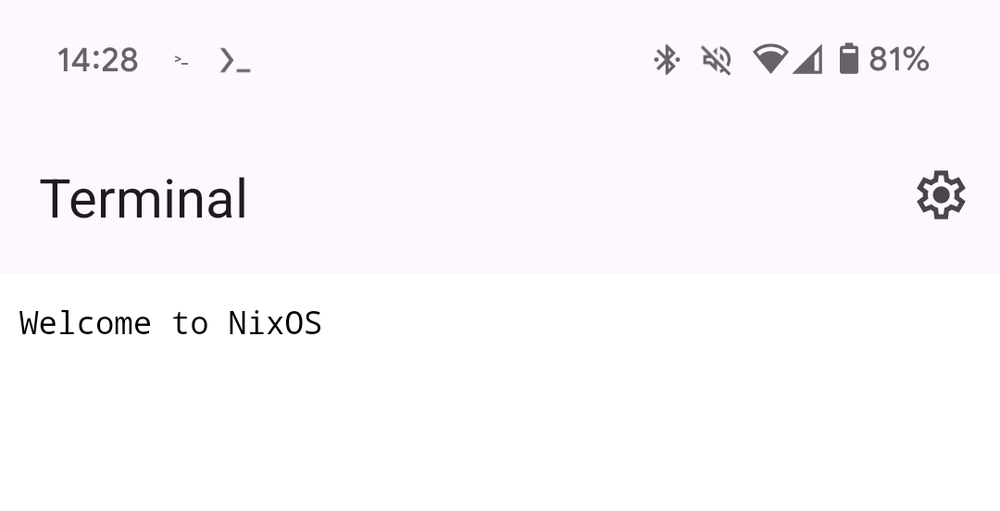
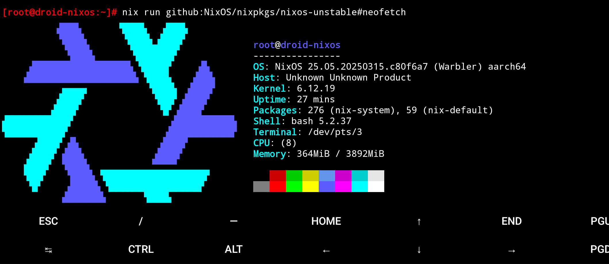

# droid-nixos

NixOS VM on the Android "Terminal" app

## What on earth is this?

Google shipped a "Linux development environment" to Pixel devices around March 2025.

It runs a Debian VM. We can replace it with NixOS with `/etc/NIXOS_LUSTRATE`. Since it's "just" an AArch64 VM it runs mainline Linux just fine.

## Screenshots

## More information:

- [`doc/install.md`](doc/install.md)
- [`doc/notes.md`](doc/notes.md)
